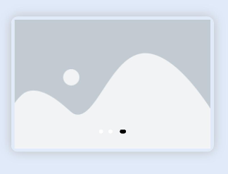

# neumorphism
--Neumorphism for OpenHarmony.

## Download & Install

```npm install @ohos/neulib```

## Usage Instructions

```ets
import {Theme,strTheme,button,strButton,buttons,strButtons,avatar,strAvatar,dropdown} from '@ohos/neulib'
import {strDropdown,input,strInput,card,strCard,carousel,strCarousel,progress,strProgress} from '@ohos/neulib'
import {alert,strAlert,label,strLabel,navbar,strNavbar,pagination,strPagination,radio} from '@ohos/neulib'
import {switcher,strRadio,strSwitcher,checkbox,strCheckbox} from '@ohos/neulib'
```

# Theme

<p float="left">


</p>

```ets
import {Theme,strTheme} from '@ohos/neulib'

@State theme: strTheme.Model = new strTheme.Model();

Theme({ theme: this.theme })
```

# Alert


```ets
import {alert,strAlert} from '@ohos/neulib'

alert: strAlert.Model = new strAlert.Model();

alert({alert: this.alert, theme: this.theme})
```

# Avatar


```ets
import {avatar,strAlert} from '@ohos/neulib'

avatar: strAvatar.Model = new strAvatar.Model();

avatar({avatar: this.avatar, theme: this.theme})
```

# Button


```ets
import {button,strButton} from '@ohos/neulib'

button: strButton.Model = new strButton.Model();

button({button: this.button, theme: this.theme})
```

# Buttons


```ets
import {buttons,strButtons} from '@ohos/neulib'

buttons: strButtons.Model = new strButtons.Model();

buttons({buttons: this.buttons, theme: this.theme})
```

# Card


```ets
import {card,strCard} from '@ohos/neulib'

card: strCard.Model = new strCard.Model();

card({card: this.card, theme: this.theme})
```

# Checkbox


```ets
import {checkbox,strCheckbox} from '@ohos/neulib'

checkbox: strCheckbox.Model = new strCheckbox.Model();

checkbox({checkbox: this.checkbox, theme: this.theme})
```

# Dropdown


```ets
import {dropdown,strDropdown} from '@ohos/neulib'

dropdown: strDropdown.Model = new strDropdown.Model();

dropdown({dropdown: this.dropdown, theme: this.theme})
```

# Form


```ets
Flex({ direction: FlexDirection.Column, justifyContent: FlexAlign.Center, alignItems: ItemAlign.Center }) {
  input({ input: this.emailInput, theme: this.theme })
  input({ input: this.passwordInput, theme: this.theme })
  Row() {
    button({ button: this.submit, theme: this.theme })
    button({ button: this.reset, theme: this.theme })
  }
}
.backgroundColor(this.theme.getBackgroundColor())
.width('750px')
.height('700px')
.borderRadius('50px')
.shadow({ radius: this.theme.getShadowRadius(),
  color: this.theme.getDownShadow()})
```

# Input


```ets
import {input,strInput} from '@ohos/neulib'

input: strInput.Model = new strInput.Model();

input({input: this.input, theme: this.theme})
```

# Label


```ets
import {label,strLabel} from '@ohos/neulib'

label: strLabel.Model = new strLabel.Model();

label({label: this.label, theme: this.theme})
```

# Navbar


```ets
import {navbar,strNavbar} from '@ohos/neulib'

navbar: strNavbar.Model = new strNavbar.Model();

navbar({navbar: this.navbar, theme: this.theme})
```

# Pagination


```ets
import {pagination,strPagination} from '@ohos/neulib'

pagination: strPagination.Model = new strPagination.Model();

pagination({pagination: this.pagination, theme: this.theme})
```

# Progress


```ets
import {progress,strProgress} from '@ohos/neulib'

progress: strProgress.Model = new strProgress.Model();

progress({progress: this.progress, theme: this.theme})
```

# Radio


```ets
import {radio,strRadio} from '@ohos/neulib'

radio: strRadio.Model = new strRadio.Model();

radio({radio: this.radio, theme: this.theme})
```

# Switcher


```ets
import {switcher,strSwitcher} from '@ohos/neulib'

switcher: strSwitcher.Model = new strSwitcher.Model();

switcher({switcher: this.switcher, theme: this.theme})
```

# Carousel



```ets
import {carousel,strCarousel} from '@ohos/neulib'

carousel: strCarousel.Model = new strCarousel.Model();

caousel({carousel: this.carousel, theme: this.theme})
```

## Compatibility

Supports OpenHarmony API version 9

## Directory Structure

````
|---- Neumorphism  
|     |---- entry  # sample app usage
|     |---- NeuLib  # Neumorphism library
|           |----src
|                 |----main
|                      |----ets
|                           |----components
|                                |----MainPage
|                                     |---- alert.ets  # Alert Component
|                                     |---- strAlert.ets
|                                     |---- avatar.ets  # Avatar Component
|                                     |---- strAvatar.ets
|                                     |---- button.ets  # Button Component
|                                     |---- strButton.ets
|                                     |---- buttons  # Buttons Component
|                                     |---- strButtons.ets
|                                     |---- card  # Card Component
|                                     |---- strCard.ets
|                                     |---- carousel  # Carousel Component
|                                     |---- strCarousel.ets
|                                     |---- checkbox  # Checkbox Component
|                                     |---- strCheckbox.ets
|                                     |---- dropdown  # Dropdown Component
|                                     |---- strDropdown.ets
|                                     |---- input  # Input Component
|                                     |---- strInput.ets
|                                     |---- label  # Label Component
|                                     |---- strLabel.ets
|                                     |---- navbar  # Navigation Bar Component
|                                     |---- strNavbar.ets
|                                     |---- pagination  # Pagination Component
|                                     |---- strPagination.ets
|                                     |---- progress  # Progress Component
|                                     |---- strProgress.ets
|                                     |---- radio  # Radio Component
|                                     |---- strRadio.ets
|                                     |---- switcher  # Switcher Component
|                                     |---- strSwitcher.ets
|                                     |---- theme  # Theme Component
|                                     |---- strTheme.ets
|
|     |---- README.MD  # installation and usage                   
````

## Compatibility

Supports OpenHarmony API version 9

## Code Contribution
If you find any problems during usage, you can submit an [Issue](https://github.com/Applib-OpenHarmony/Neumorphism-ETS/issues) to us. Of course, we also welcome you to send us [PR](https://github.com/Applib-OpenHarmony/Neumorphism-ETS/pulls).

## Open source License
This project is based on [Apache License 2.0](https://gitee.com/openharmony-sig/Neumorphism/blob/master/LICENSE.txt) ，please enjoy and participate in open source freely.

# Reference:

Design by : Vivek Choudhary and Sourav


